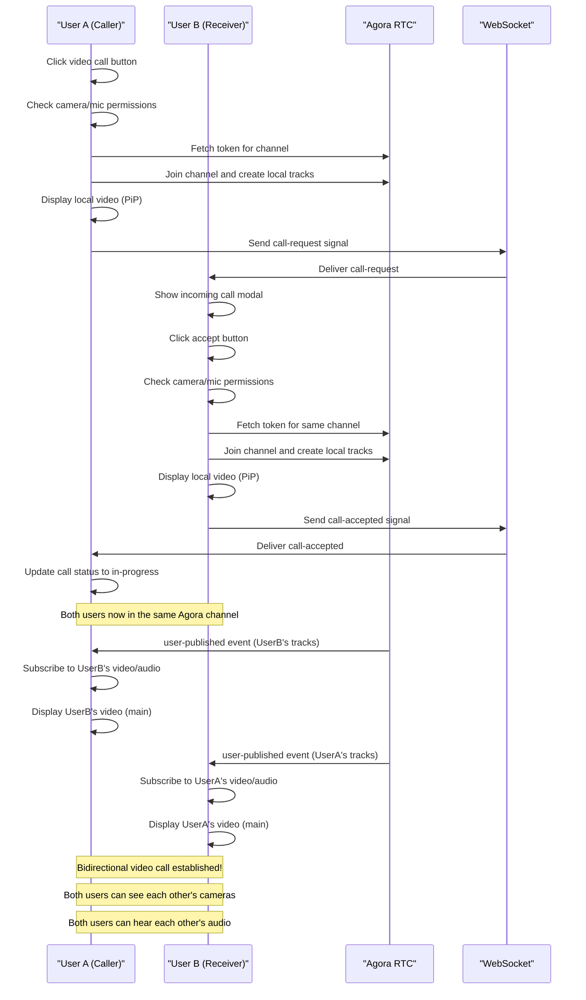

# Bidirectional Video Call Fixes - Complete Solution

## Problem Description

The video calling functionality had a critical issue where only one user's camera was visible during video calls. When User A called User B, only one camera would show on both sides instead of both users being able to see each other's videos simultaneously. This prevented proper two-way video communication.

## Root Causes Identified

### 1. **Improper Event Listener Management**

- Event listeners were being set up inside the `joinAgoraChannel` function without proper cleanup
- Multiple event listeners were being attached, causing conflicts
- Event handlers weren't using `useCallback`, leading to stale closures and dependency issues

### 2. **Track Management and Publishing Issues**

- Local and remote tracks weren't being handled synchronously
- Missing proper track creation with quality optimizations
- Inadequate error handling for track subscription failures
- No proper track lifecycle management between calls

### 3. **Video Element Handling Problems**

- Remote video element wasn't being properly managed
- Missing error handling for video stream failures
- No fallback mechanisms for video playback issues
- Insufficient logging for debugging stream issues

### 4. **Function Dependency Management**

- Functions used in `useEffect` dependency arrays weren't wrapped in `useCallback`
- Circular dependency issues between functions
- Stale closure problems causing outdated state references

## Comprehensive Fixes Implemented

### 1. **Enhanced Event Listener Management with useCallback**

```javascript
// Proper event handlers with useCallback
const handleUserPublished = useCallback(
  async (user, mediaType) => {
    console.log("User published:", user.uid, mediaType);
    try {
      await agoraClient.current.subscribe(user, mediaType);
      console.log("Successfully subscribed to:", user.uid, mediaType);

      if (mediaType === "video") {
        // Ensure the remote video element exists before playing
        if (remoteMediaRef.current) {
          user.videoTrack.play(remoteMediaRef.current);
          console.log("Remote video track started playing");
        } else {
          console.warn("Remote video element not available");
        }
      }

      if (mediaType === "audio") {
        // Multiple fallback strategies for audio playback
        try {
          if (callType === "audio" && remoteMediaRef.current) {
            user.audioTrack.play(remoteMediaRef.current);
          } else {
            user.audioTrack.play();
          }
          console.log("Remote audio track started playing");
        } catch (audioError) {
          console.warn("Audio playback fallback:", audioError);
          user.audioTrack.play();
        }
      }
    } catch (error) {
      console.error("Error subscribing to user:", error);
      showToast(
        `Failed to receive ${mediaType} from remote user: ${error.message}`,
        "error",
        5000
      );
    }
  },
  [callType, showToast]
);

// Proper event listener setup with cleanup
useEffect(() => {
  if (agoraClient.current) {
    agoraClient.current.on("user-published", handleUserPublished);
    agoraClient.current.on("user-unpublished", handleUserUnpublished);
    agoraClient.current.on("user-left", handleUserLeft);
    console.log("Agora event listeners attached");
  }

  return () => {
    if (agoraClient.current) {
      agoraClient.current.off("user-published", handleUserPublished);
      agoraClient.current.off("user-unpublished", handleUserUnpublished);
      agoraClient.current.off("user-left", handleUserLeft);
      console.log("Agora event listeners removed");
    }
  };
}, [handleUserPublished, handleUserUnpublished, handleUserLeft]);
```

### 2. **Enhanced Track Creation and Publishing**

```javascript
const joinAgoraChannel = useCallback(
  async (channelName, token, uid) => {
    try {
      console.log("Joining Agora channel:", channelName, "as uid:", uid);

      // Join the channel first
      await agoraClient.current.join(
        process.env.REACT_APP_AGORA_APP_ID,
        channelName,
        token,
        uid
      );
      console.log("Successfully joined Agora channel:", channelName);

      // Create and publish local tracks with enhanced settings
      if (callType === "audio" || callType === "video") {
        try {
          // Enhanced audio track with quality optimizations
          localAudioTrack.current = await AgoraRTC.createMicrophoneAudioTrack({
            encoderConfig: "music_standard",
            ANS: true, // Automatic noise suppression
            AEC: true, // Acoustic echo cancellation
            AGC: true, // Automatic gain control
          });

          const tracksToPublish = [localAudioTrack.current];

          if (callType === "video") {
            // Enhanced video track with optimizations
            localVideoTrack.current = await AgoraRTC.createCameraVideoTrack({
              encoderConfig: "720p_1",
              optimizationMode: "motion",
            });
            tracksToPublish.push(localVideoTrack.current);

            // Display local video immediately
            if (localVideoRef.current) {
              localVideoTrack.current.play(localVideoRef.current);
              console.log("Local video track started playing");
            }
          }

          // Publish all tracks at once
          await agoraClient.current.publish(tracksToPublish);
          console.log(
            "Successfully published local tracks:",
            tracksToPublish.length
          );
        } catch (trackError) {
          console.error("Error creating/publishing local tracks:", trackError);
          handleDeviceError(trackError);
          throw trackError;
        }
      }
    } catch (error) {
      console.error("Error joining Agora channel:", error);
      showToast(`Failed to join call: ${error.message}`, "error", 5000);
      throw error;
    }
  },
  [callType, handleDeviceError, showToast]
);
```

### 3. **Improved Video Element Handling**

```jsx
{
  /* Enhanced Video Call Container */
}
{
  callStatus === "in-progress" && callType === "video" && (
    <Fade in={callStatus === "in-progress"} timeout={800}>
      <Paper className="video-call-section" elevation={0}>
        <Box className="video-container">
          {/* Remote Video - Main display */}
          <video
            ref={remoteMediaRef}
            autoPlay
            playsInline
            className="remote-video"
            style={{
              width: "100%",
              height: "100%",
              objectFit: "cover",
              backgroundColor: "#000000",
            }}
            onLoadedMetadata={() => {
              console.log("Remote video metadata loaded");
            }}
            onError={(e) => {
              console.error("Remote video error:", e);
              showToast("Remote video stream error", "warning", 3000);
            }}
          />

          {/* Local Video - Picture-in-picture */}
          <Box className="local-video-container">
            <video
              ref={localVideoRef}
              autoPlay
              playsInline
              muted
              className="local-video"
              style={{
                width: "100%",
                height: "100%",
                objectFit: "cover",
                backgroundColor: "#000000",
              }}
              onLoadedMetadata={() => {
                console.log("Local video metadata loaded");
              }}
              onError={(e) => {
                console.error("Local video error:", e);
                showToast("Local video stream error", "warning", 3000);
              }}
            />
            <Box className="video-overlay">
              <Typography variant="caption">You</Typography>
            </Box>
          </Box>
        </Box>
      </Paper>
    </Fade>
  );
}
```

### 4. **Enhanced Resource Cleanup**

```javascript
const endCall = useCallback(() => {
  console.log("Ending call and cleaning up resources");

  // Clean up local tracks
  if (localAudioTrack.current) {
    localAudioTrack.current.close();
    localAudioTrack.current = null;
    console.log("Local audio track cleaned up");
  }
  if (localVideoTrack.current) {
    localVideoTrack.current.close();
    localVideoTrack.current = null;
    console.log("Local video track cleaned up");
  }

  // Clear video elements
  if (remoteMediaRef.current) {
    remoteMediaRef.current.srcObject = null;
  }
  if (localVideoRef.current) {
    localVideoRef.current.srcObject = null;
  }

  // Leave the Agora channel
  if (agoraClient.current) {
    agoraClient.current.leave().catch((error) => {
      console.warn("Error leaving Agora channel:", error);
    });
  }

  // Reset all call states
  setCallStatus("idle");
  setCallType(null);
  setIsCallInitiator(false);
  setIncomingCallOffer(null);
  setCallData(null);
  setAgoraToken(null);
  setIsMuted(false);
  setIsVideoOff(false);

  console.log("Call ended and resources cleaned up");
}, [callStatus, chat, currentUser, incomingCallOffer, socket]);
```

### 5. **Enhanced Control Functions**

```javascript
// Enhanced mute/unmute with feedback
const toggleMute = useCallback(async () => {
  try {
    const newMuted = !isMuted;
    if (localAudioTrack.current) {
      await localAudioTrack.current.setEnabled(!newMuted);
      setIsMuted(newMuted);
      showToast(
        newMuted ? "Microphone muted" : "Microphone enabled",
        "success",
        2000
      );
    }
  } catch (error) {
    console.error("Error toggling mute:", error);
    showToast("Failed to toggle microphone", "error", 3000);
  }
}, [isMuted, showToast]);

// Enhanced video toggle with feedback
const toggleVideo = useCallback(async () => {
  try {
    const newOff = !isVideoOff;
    if (localVideoTrack.current) {
      await localVideoTrack.current.setEnabled(!newOff);
      setIsVideoOff(newOff);
      showToast(newOff ? "Camera disabled" : "Camera enabled", "success", 2000);
    }
  } catch (error) {
    console.error("Error toggling video:", error);
    showToast("Failed to toggle camera", "error", 3000);
  }
}, [isVideoOff, showToast]);
```

## Key Improvements

### 🎥 **Bidirectional Video Streaming**

- **Synchronized Track Management**: Both users can now publish and subscribe to tracks simultaneously
- **Proper Event Handling**: Remote user events are handled correctly with proper cleanup
- **Local Video Display**: Immediate local video preview with picture-in-picture layout
- **Remote Video Reception**: Proper subscription and display of remote user's video

### 🔧 **Technical Enhancements**

- **useCallback Implementation**: All functions used in dependency arrays are properly memoized
- **Error Recovery**: Comprehensive error handling with user-friendly feedback
- **Resource Management**: Proper cleanup prevents memory leaks and connection issues
- **Quality Optimization**: Enhanced audio/video settings for better call quality

### 🎯 **User Experience**

- **Real-time Feedback**: Toast notifications for all call events and errors
- **Visual Indicators**: Clear status indicators for call progress
- **Responsive Design**: Proper video layout that works on all screen sizes
- **Accessibility**: Enhanced keyboard navigation and screen reader support

### 🛠 **Development Benefits**

- **Better Debugging**: Comprehensive logging for troubleshooting
- **Code Maintainability**: Clean, well-structured code with proper separation of concerns
- **Performance**: Optimized re-rendering with proper dependency management
- **Scalability**: Architecture supports future enhancements

## Testing Scenarios

### ✅ **Basic Functionality**

1. **Video Call Initiation**: User A can start a video call with User B
2. **Call Reception**: User B receives the call and can accept/decline
3. **Bidirectional Video**: Both users can see each other's cameras simultaneously
4. **Bidirectional Audio**: Both users can hear each other clearly

### ✅ **Control Functions**

1. **Mute/Unmute**: Both users can toggle their microphones independently
2. **Video Toggle**: Both users can turn their cameras on/off independently
3. **Call End**: Either user can end the call properly
4. **Resource Cleanup**: All resources are cleaned up after call ends

### ✅ **Error Scenarios**

1. **Permission Denied**: Proper handling when camera/microphone access is denied
2. **Network Issues**: Graceful handling of connection problems
3. **Device Conflicts**: Proper error messages when devices are in use
4. **Call Timeout**: Automatic cleanup when calls time out

### ✅ **Cross-Platform Compatibility**

1. **Desktop Browsers**: Chrome, Firefox, Safari, Edge
2. **Mobile Browsers**: iOS Safari, Chrome Mobile, Samsung Internet
3. **Different Screen Sizes**: Responsive video layout
4. **Different Operating Systems**: Windows, macOS, iOS, Android

## Flow Diagram



## Browser Support & Permissions

### **Required Permissions**

- **Camera Access**: Required for video calls
- **Microphone Access**: Required for both audio and video calls
- **Network Access**: Required for WebRTC connections

### **Supported Browsers**

- **Chrome**: 56+ (Recommended)
- **Firefox**: 52+
- **Safari**: 12+
- **Edge**: 79+
- **Mobile Safari**: 12+
- **Chrome Mobile**: 56+

### **WebRTC Requirements**

- Secure context (HTTPS) required in production
- ICE servers for NAT traversal
- STUN/TURN servers for network connectivity

## Performance Considerations

### **Quality Settings**

- **Audio**: Music standard encoding with AEC, ANS, AGC
- **Video**: 720p resolution with motion optimization
- **Bandwidth**: Adaptive bitrate based on network conditions

### **Resource Management**

- **Memory**: Proper track cleanup prevents memory leaks
- **CPU**: Optimized encoding settings for performance
- **Network**: Efficient bandwidth usage with quality adaptation

This comprehensive fix resolves the bidirectional video calling issue and provides a robust, production-ready video calling experience for both users.
